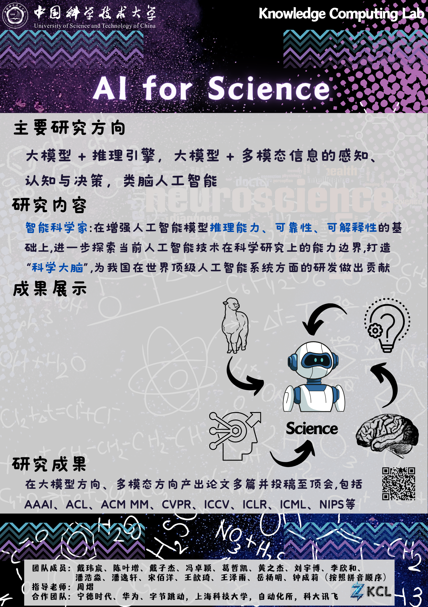

# KCL-lab

  We are the AI4Science group of the Knowledge Computing Laboratory of the University of Science and Technology of China.

  

## Achievements

  https://github.com/zhouyilab/SHAPE
  https://github.com/lihong2303/AGM_ICCV2023
  https://github.com/whyNLP/Conic10K
  https://github.com/cyzhh/MMOS 

## 😇 Acknowledge

  https://github.com/yangjianxin1/Firefly
